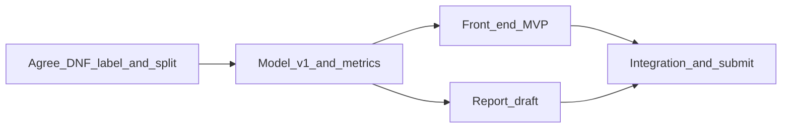

# Project schedule (due **June 7** — group of **4**)

Final deliverables: working **model + code**, **written report**, and **front end** (dashboard or demo UI). Adjust if your instructor defines June 7 as end-of-day June 6 or a specific upload time.

## Roles (adapt to your skills)

| Track | Primary owner(s) | Others |
|--------|------------------|--------|
| **Data & model** | 2 people | Metrics and plots for report; export or API contract for UI |
| **Report** | 1 person (lead) | Everyone reviews; model owners supply results tables |
| **Front end** | 1 person (lead) | Pair with model owner during integration week |

## Milestones

| Date (target) | Milestone | Done when |
|---------------|-----------|-----------|
| **May 9** | Foundations | DNF label rule and time-based split agreed and documented (see notebook); repo stays organized |
| **May 23** | Model v1 frozen | Baseline + one improved model; metrics table; no-leakage check; saved reproducible artifact |
| **May 30** | Front end + report drafts | UI MVP wired to agreed I/O; report outline complete with Methods, Data, and Results populated |
| **June 6** | Integration and polish | FE uses final model path; report figures match latest run; README run instructions; group dry run |
| **June 7** | Submit | Final report PDF (or per rubric) + repo or archive + demo notes |

**Buffer option:** move model freeze to **May 26** and drafts to **June 2**; keep June 6–7 for hardening only.

## Owner and reviewer matrix

Replace `Member 1` … `Member 4` with names. Use **O** = primary owner, **R** = reviewer for that milestone.

| Milestone | Member 1 | Member 2 | Member 3 | Member 4 |
|-----------|----------|----------|----------|----------|
| May 9 — Foundations | | | | |
| May 23 — Model v1 | | | | |
| May 30 — Drafts (FE + report) | | | | |
| June 6–7 — Integration and submit | | | | |

## Weekly rhythm

- **Monday:** 15 minutes async — blockers only  
- **Midweek:** One person posts updated metrics or a UI screenshot for the report  
- **Friday:** 30–45 minutes — merge work, assign at most two priorities for the next week  

## Dependency order

Front end and report run in parallel after the model track has v1 metrics. **Freeze the model I/O contract by May 30** (for example: `predictions.csv` from a notebook cell, or `model.joblib` + feature column list loaded by `app.py`).

## Deliverable checklists (check off as you go)

### May 23 — Model v1

- [ ] Baseline model trained and evaluated on the agreed time split  
- [ ] At least one improved model (features or algorithm) with comparison table  
- [ ] Leakage review (no future labels in features; split respects race time)  
- [ ] Artifact saved or reproducible section (pickle/joblib, or pinned notebook run)  

### May 30 — Drafts

- [ ] Front end MVP shows prediction or summary consistent with the model  
- [ ] Report: Introduction, Data, Methods, Results (draft figures OK)  
- [ ] Figure numbers and metrics synced with the current notebook run  

### June 6–7 — Ship

- [ ] Front end uses final model path or export  
- [ ] README documents how to run notebook and/or app  
- [ ] Final report proofread; submission checklist per course rubric  
- [ ] 10–15 minute group dry run completed  

See also [`reports/README.md`](reports/README.md) and [`frontend/README.md`](frontend/README.md) for where drafts can live.
